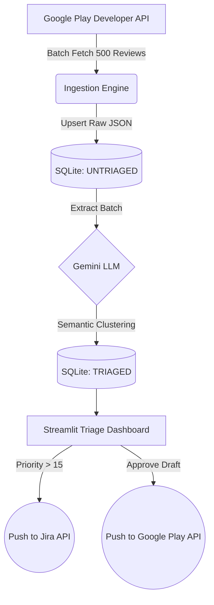

# ReviewPulse AI

An open-source, security-first Play Store Triage & Response Engine built to bridge the gap between user feedback and engineering backlogs.

---

## Business Impact & KPIs

ReviewPulse AI is designed to shift your mobile game operations from reactive to proactive, delivering measurable impacts across three core operational vectors:

1. **MTTR (Mean Time to Respond) Reduction:** By clustering hundreds of isolated feedback reports into unified issues and generating 350-character Gemini-drafted templates instantly, ReviewPulse drops the support response bottleneck from days to minutes.
2. **Engineering Velocity Optimization (Rating Drag™):** Not all bugs are equal. ReviewPulse quantifies issue severity using the *Rating Drag* algorithm `Priority Score = Cluster Frequency * (Target Store Rating - Average Cluster Rating)`. High-impact clusters (Score > 15) are dynamically routed directly to your Jira backlog, ensuring developers only tackle what affects revenue and store visibility.
3. **Triage Hour Reduction:** Replaces chaotic spreadsheet analysis with an automated, idempotent SQLite + LLM pipeline, reclaiming hundreds of manual community management hours per month.

---

## Architecture

ReviewPulse AI utilizes an offline-first batch processing strategy to respect strict API limitations and quota caps.



---

## Frontend Export Prep (React/Next.js)

If your team plans to detach the Streamlit presentation layer and migrate to a static or server-side rendered frontend like **Next.js**, please be aware of Mermaid.js hydration issues. 

**Implementation Guide:**
Do not render the Mermaid graph as standard markdown strings in a strict SSR environment. Instead, utilize the `react-mermaid2` module and lazy-load the component on the client-side to prevent hydration mismatch errors:

```javascript
import dynamic from 'next/dynamic';

// Dynamically import the Mermaid component, disabling SSR
const Mermaid = dynamic(() => import('react-mermaid2'), { ssr: false });

export default function ArchitectureView() {
  return (
    <Mermaid chart={`graph TD\n A-->B`} />
  );
}
```

---

## Getting Started

1. Initialize a virtual environment: `python3 -m venv venv && source venv/bin/activate`
2. Install requirements: `pip install -r requirements.txt`
3. Duplicate `.env.example` to `.env` and fill in your keys.
4. Run `python -m scripts.init_db`
5. Boot Dashboard: `streamlit run app/main.py`
