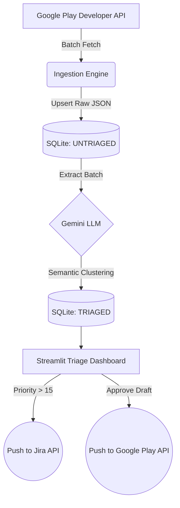

# ReviewPulse AI

[](https://opensource.org/licenses/MIT)
[](https://www.python.org/downloads/)
[](https://streamlit.io)


*(Note: Add screenshot to `docs/assets/dashboard_hero.png`)*

**An open-source, local-first Play Store review triage engine. Clusters feedback, calculates priority scores, and drafts AI responses directly to Jira.**

Stop manually reading spreadsheets of app reviews. ReviewPulse AI automatically clusters Google Play feedback, ranks bugs by their impact on your store rating (Rating Drag), and drafts empathetic responses using Gemini—all without your data ever leaving your local machine.

---

## ⚡ The 30-Second Demo (No API Keys Required)

Want to see how the dashboard works without setting up Google Play API keys? You can run the unified CLI to inject realistic mock data and launch the UI instantly.

1. Clone the repo and navigate to the directory:
   ```bash
   git clone https://github.com/stonedhawk/review-pulse-AI.git
   cd review-pulse-AI
   ```
2. Run the local setup script to install dependencies:
   ```bash
   sh setup.sh  # (On Windows, run setup.bat)
   source venv/bin/activate
   ```
3. Run the Demo command!
   ```bash
   python pulse.py demo
   ```
This will instantly populate the database with mock reviews, run a local deterministic algorithm to cluster them, and generate a readable report at `data/demo_output.md`.

**Sample Demo Output:**
```markdown
## Crash on Startup (Priority Score: 17.5)
- Issues Count: 5
- Average Rating: 1.0/5
- AI Draft Response: _We apologize for the crashing issues. Our team is investigating..._

## Gacha Rates / Monetization (Priority Score: 10.0)
- Issues Count: 4
- Average Rating: 2.0/5
- AI Draft Response: _We appreciate your feedback on the summon rates..._
```

*(You can also run `python pulse.py ui` afterward to view the Streamlit dashboard!)*

---

## 📈 Business Impact & KPIs

ReviewPulse AI shifts your mobile game operations from reactive to proactive, delivering measurable impacts:

1. **MTTR (Mean Time to Respond) Reduction:** Clusters hundreds of isolated feedback reports into unified issues and generates 350-character Gemini-drafted templates instantly.
2. **Engineering Velocity Optimization (Rating Drag):** Not all bugs are equal. ReviewPulse quantifies issue severity using the *Rating Drag* algorithm `Priority Score = Cluster Frequency * (Target Store Rating - Average Cluster Rating)`. High-impact clusters (Score > 15) can be dynamically routed directly to your Jira backlog.
3. **Triage Hour Reduction:** Replaces chaotic spreadsheet analysis with an automated SQLite + LLM pipeline, reclaiming hundreds of manual community management hours.

---

## Prerequisites

Before running ReviewPulse AI with real data, you'll need:

- **Python 3.11+**
- **Google Play Developer API** — a service account JSON with "Reply to Reviews" permission. [Setup guide](https://developers.google.com/android-publisher/getting_started)
- **Gemini API key** — get one at [aistudio.google.com](https://aistudio.google.com)
- **Jira API token** (optional) — only required for automatic backlog routing
- **Docker** (optional) — recommended for team deployments

---

## 🛠️ Production Installation

When you are ready to process real data, you must provide your Google Play and Gemini API credentials.

### Step 1: The Configuration File (`.env`)
1. Rename `.env.example` to `.env`.
2. Fill out the fields:
   - `PLAY_STORE_PACKAGE_NAME`: The ID of your game (e.g., `com.yourcompany.yourgame`).
   - `GEMINI_API_KEY`: Generate a free AI key at [Google AI Studio](https://aistudio.google.com/app/apikey). 
   - `GOOGLE_APPLICATION_CREDENTIALS_JSON`: A Service Account JSON from your Google Play Console with "Reply to Reviews" permission. Paste it **on a single line** next to the `=` sign.
   - `JIRA_*`: (Optional) Fill these out to enable the "Push to Jira" button.

### Step 2: Deployment

Choose **one** of the methods below. Method A is highly recommended for teams.

#### Method A: Docker (Recommended)
If you have Docker installed, simply run:
```bash
docker-compose up -d --build
```
This builds the database, starts the UI in the background, and mounts a persistent volume so you never lose your triage data.

#### Method B: Local Environment
If you prefer running it locally, activate your virtual environment (`source venv/bin/activate`) and use the unified CLI:

```bash
# 1. Fetch new reviews from Google Play
python pulse.py fetch

# 2. Cluster untriaged reviews using Gemini
python pulse.py process

# 3. Start the UI Dashboard
python pulse.py ui
```

---

## Verify Your Setup

**Quick check (no API keys needed):** Run the demo command after local setup:

```bash
python pulse.py demo
```

This populates the database with mock reviews, runs the clustering pipeline locally, and outputs a readable report to `data/demo_output.md`. If you see priority-scored clusters in the output, the core pipeline is working.

**Production check:** After configuring your `.env`, run:

```bash
python pulse.py fetch
```

A successful run prints the number of reviews fetched. If this fails, the most common causes are:
- `GOOGLE_APPLICATION_CREDENTIALS_JSON` is malformed (must be valid JSON on a single line)
- Service account doesn't have Play Developer API enabled in GCP Console

---

## 🏗️ Architecture & Security

ReviewPulse AI utilizes an offline-first batch processing strategy to respect strict API limitations and quota caps.



### Security First
- **Zero-File Credentials:** Keys are injected directly into memory via `.env` to prevent accidental GitHub commits.
- **Local Persistence:** Data is stored in a local SQLite WAL database. Your proprietary triage metrics never sync to a third-party cloud.
- **Privacy Boundary:** Internal metrics and Jira configs are strictly stripped from the LLM context window. Gemini only sees the raw, anonymized review text. See `SECURITY.md` for more details.

